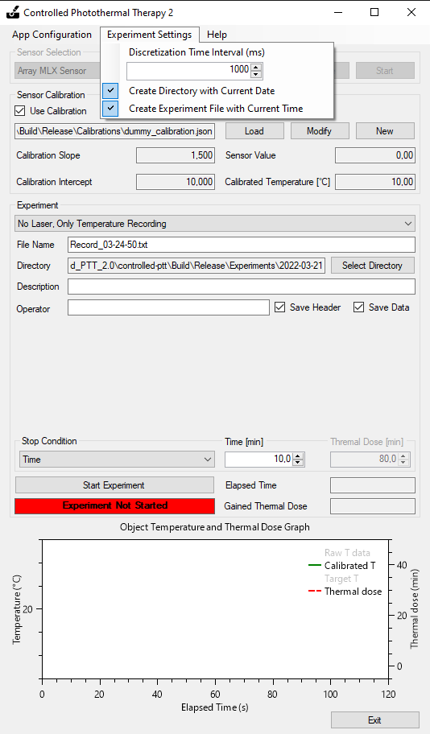

## ControlledPTT.App

This C# project hosts the main startup application of the Controlled PTT 2. When the Release-v2.x.x is downloaded, it is ControlledPTT.App.exe that must be tun in order for the Controlled PTT 2 to work. 

### Reqiurements

- [.NET Framework 4.7.2](https://dotnet.microsoft.com/download/dotnet-framework/net472) to run the software on a PC with Windows OS. .NET Framework 4.7.2 is included by default in Windows 7 or higher.

### Main functionality

ControlledPTT.App controls all the main functions:
1. It performs the connection to the selected [Sensor part](../Sensors) and received the temperature data. The Sensor parts can be added by the user if they cannot be found by the ControlledPTT.App.
2. It performs and stores the calibration data for the temperature sensor. The calibration can be added, saved and modified through the ControlledPTT.App.
3. It performs the connection to the selected [Laser part](../Lasers) and set the laser power if the appropriate [experiment type](#experiment-types) is selected. The Laser parts can be added by the user if they cannot be found by the ControlledPTT.App.
4. It records the all the experimental data and additional meta parameters that can be found on the interface.
5. Different user configurations (parameters) can be saved and reused making it easier for different user to use the software.

### Important parameters and functions

The important option is "Discretization Time Interval" in ms; it can be modified in the Experimetal Setting menu. The "Discretization Time Interval" governs the time interval between the events during the experiment. In particular, it controls how often the temperature data from Sensor part is sent to the ControlledPTT.App, how often the data is processed and saved, and  how often Laser power is set. For example, if the "Discretization Time Interval" equals to 1000 ms, then each second data is obtained from a Sensor part, the data is modified according to the loaded calibration, the laser power is calculated and sent to the Laser part if the appropriate experiment type is selected.

"Discretization Time Interval" must be carefully selectd based on the current experiment requirements. It cannot be too small, because then it is possible that the ControlledPTT.App cannot perform all the functions before the second timer tick fires. Furthermore, short "Discretization Time Interval" does not allow to average the temperature sensor data, which is typically quite noisy. Too long "Discretization Time Interval" can, on the other hand, make controlling the experiment less responsive, especially of the laser power must be controlled to keep the selected temperature.

### Experiment types

There are three main types of experiments:
- Experiment with only sensor part connected. ControlledPTT.App receives the data from sensor, uses calibration if applicable, writes the data to file. This experiment type can be used if laser is operated manually or there is no laser at all.
- Experiment with a full laser power. The power of laser is set by the user in laser window and ControlledPTT.App only switches laser on when experiment is started and off when experiment is over.
- Experiment with controlled laser power to achieve a specific temperature of the irradiated target. The power of laser is controlled using a built in Proportional-Integrtal-Differential (PID) controller in the limits set by the user in the laser window. The PID coefficients must be calibrated for the specifically used laser in order to be efficient.

There are there different stop conditions for an experiment:
- Stop when time expires.
- Stop when specified thermal dose of the object is gained. More about thermal dose can be found in our [publication](https://www.sciencedirect.com/science/article/pii/S0378517320306414).
- Stop when either timer expires or specified thermal dose is gained.