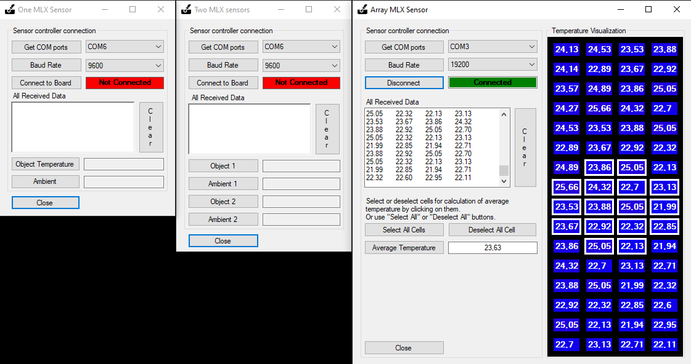
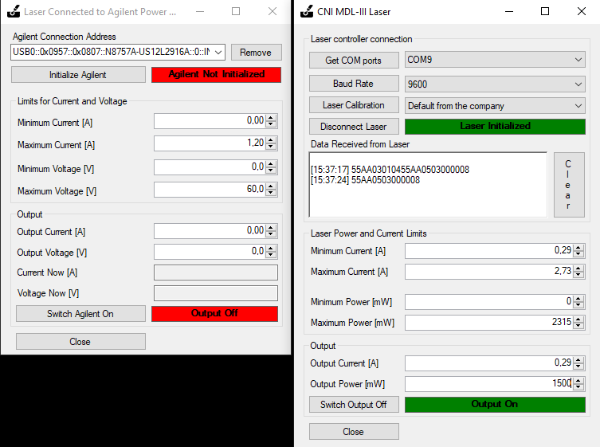

# Controlled Photothermal Therapy 2.0

Controlled Photothermal Therapy 2.0 (or just Controlled PTT 2) is the second version of software and hardware setup to study thermal effects of nanoparticles under laser irradiation *in vitro* (on living cells) or *in vivo* (in small animals). The primary aim is to control the temperature if cell media *in vitro*, but the setup can be applied for animal studies. Depending on time of laser irradiation, nanoparticle type, their photothermal conversion efficiency, different thermal dose can be delivered to the irradiated object. Thus, different biological responses can be triggered depending on the maximum achived temperature and gained thermal dose. More about thermal dose can be found in our [publication](https://www.sciencedirect.com/science/article/pii/S0378517320306414).

Controlled PTT 2 consists of two main parts: [hardware part](#hardware) and [software part](#software). The hardware part consists of temperature sensor(s) and a laser. Depending on the application, different sensor parts and laser parts can be used. You can also develop your own sensor or laser parts, or they can be developed specifically for you upon a request. Please contact [Konstantin Tamarov](mailto:konstantin.tamarov@uef.fi) to discuss your requirements.

Controlled PTT 2 was developed by Konstantin Tamarov, PhD, Emilia Happonen, MSc, and Mikke Varis at Department of Applied Physics at University of Eastern Finland. Please see [Credits](#credits) section for the correct referencing when using the software.

## Requrements

The software consists of the PC program written in C# programming language and the borad part which reads the temperature sensor data and sends it to the PC program.

- [.NET Framework 4.7.2](https://dotnet.microsoft.com/download/dotnet-framework/net472) to run the software on a PC with Windows OS. .NET Framework 4.7.2 is included by default in Windows 7 or higher.
- [Arduino Studio 1.8.13](https://www.arduino.cc/en/software) or higher. Arduino Studio is needed to install necessary drivers and upload the program to the board. Refer to the [sensors](#selecting-sensor-part) section for more information about temperature sensors and boards.

## Usage

In order to use Controlled PTT 2 software, at least one [sensor hardware part](#selecting-sensor-part) must be assembled and programmed. The available sensor parts, detailed instruction to assemble and program them are located in [Sensors](./Sensors) directory. Arduino Studio must be installed in any case to upload sketch to the sensor board and provide necessary drivers.

The Controlled PTT 2 software requires either its executables to be [downloaded](#download-executables) from the [latest release](https://github.com/naitsok/controlled-ptt/releases/) or it can be [built from the source](#building-from-the-source-code).

### Download executables

To use the Controlled PTT 2 executables directly do the following:
1. Download Executables.zip archive from the [latest release](https://github.com/naitsok/controlled-ptt/releases/).
2. Unpack the contents of Executables.zip to any suitable location (e.g. Program Files, Documents, Desktop, etc.).
3. Navigate to Sensors directory and select the appropriate sensor. Sketches and necessary libraries for boards are located in Board* directory for each sensor.
4. Upload the selected sensor's sketch to the board using Arduino Studio. The detailed instruction for boards are in the [Sensors](./Sensors).
5. Run the ControlledPTT.App.exe. More information about its capabilities and interface is in [App](./App).
6. Select the correct sensor in the CotrolledPTT.App and press "Start" button. In the opened Sensor interface press "Connect to Board" button and verify that the sensor starts to sent the temperature to the ControlledPTT.App.
7. The basic setup is ready to record temperature and thermal dose. No laser is connected in the basic setup. 

### Building from the source code

To build the Contolled PTT 2 from source do the following:
1. Install [Visual Studio 2019](https://visualstudio.microsoft.com/downloads/) with C# and Windows Forms as development environment.
2. Download source code from the [latest release](https://github.com/naitsok/controlled-ptt/releases/) or clone the repository using the git command `git clone https://github.com/naitsok/controlled-ptt`.
3. Navigate to controlled-ptt/Sensors directory and select the appropriate sensor. Sketches and necessary libraries for boards are located in Board* directory for each sensor.
4. Upload the selected sensor's sketch to the board using Arduino Studio. The detailed instruction for boards are in the [Sensors](./Sensors).
5. Run Visual Studio and open the [controlled-ptt/ControlledPTT.sln](./ControlledPTT.sln) file. There should be 9 C# project including ControlledPTT.App.
6. Make sure that Startup Project is ControlledPTT.App in the dropdown list in the panel below menu.
7. Select either Debug or Release.
8. In the Visual Studio interface press "Start" to start building solution. If there are no errors, ControlledPTT.App will launch after a while.
9. The built executables together with the sketches can be then found in the "Build" directory inside the cloned controlled-ptt directory.

### Selecting sensor part

The curently developed sensor parts are based on the [Melexis](https://www.melexis.com/en) infrared temperature sensors:
1. MLX90621ESF-BAD-000. 16x4  array sensor with FOV 40x10 degrees (40 - 50 €).
2. MLX90614ESF-BCF-000. Single pixel sensor with FOV 10 degrees (25 - 35 €).
3. MLX90614ESF-BCI-000. Single pixel sensor with FOV 5 degrees (30 - 40 €).

The latter two single point sensors can be used on their own with a basic Arduino board (Uno, RedBoard, etc.). See [MLX Sensor](./Sensors/MLXSensor) part for more details. 

Furthermore, two single point sensors can be simultaneously attached to one board for better precision. See [Two MLX Sensors](./Sensors/TwoMLXSensors) part for more details. 

Array sensor requires a board with more memory than Arduino. In our case a [Teensy 3.6](https://www.pjrc.com/teensy/) board was used. See [Array MLX Sensor](./Sensors/ArrayMLXSensor) part for more details.

In order to use a selected sesnor part, the sensor must be correcly mounted to board and the appropriate sketch must be uploaded to the board. The detailed description of board wiring and sketch uploading can be found on the links above.

If there is no part suitable for your hardware, new sensor part [can be developed](#developing-a-new-sensor-part) upon a [request](mailto:konstantin.tamarov@uef.fi) or by [yourself](#development). 

#### Troubleshooting

- Mkae sure that the board connected via USB is recognized by PC. It can be done using Windows Device Manager and checking if there are unrecognized USB devices.
- After uploading the sketch to the board using Arduino Studio, Serial Monitor there can be used to check if board is sending data to PC.
- The compiled Windows Forms executables for each sensor part can be run separately without running ControlledPTT.App. By clicking "Connect to Board" button, the received data from board can be verified. Note that Serial Monitor of Arduino Studio must be closed.

### Selecting laser part

At this moment the only option is to connect a laser diode to [Agilent N5768A or similar](./Lasers/Agilent) power supply, which is in turn connected to PC and ControlledPTT.App. The power supply sets the current to the laser diode and thus regulate its power.

Thus, if you have a specific laser hardware which can be connected to PC, new laser part [can be developed](#developing-a-new-laser-part) upon a [request](mailto:konstantin.tamarov@uef.fi) or by [yourself](#development).

## Detailed description

### Hardware

### Software

Controlled PTT 2 Software consists of three parts:
1) ControlledPTT.App(.exe) is the main application executable. It performes connection to sensor and laser part, manages sensor and laser, creates and keeps calibration for sensor data, and performes the experiment.

There are three main types of experiments:
- Experiment with only sensor part connect. ControlledPTT.App receives the data from sensor, uses calibration if applicable, writes the data to file. This experiment type can be used if laser is operated manually or there is no laser at all.
- Experiment with a full laser power. The power of laser is set by the user in laser window and ControlledPTT.App only switches laser on when experiment is started and off when experiment is over.
- Experiment with controlled laser power to achieve a specific temperature of the irradiated target. The power of laser is controlled using a built in Proportional-Integrtal-Differential (PID) controller in the limits set by the user in the laser window. The PID coefficients must be calibrated for the specifically used laser in order to be efficient.

There are there different stop conditions for an experiment:
- Stop when time expires.
- Stop when specified thermal dose of the object is gained. More about thermal dose can be found in our [publication](https://www.sciencedirect.com/science/article/pii/S0378517320306414).
- Stop when either timer expires or specified thermal dose is gained.

2) ControlledPTT.Sensors.(MLXSensor|TwoMLXSensors|ArrayMLXSensor)(.exe) are executables for sensor parts. Inside of the deirectories for each sensor executable there is a folder with sketches for Arduino Studio and detailed instruction of board wiring and sketch upload guide. In the top of ControlledPTT.App interface sensor part can be selected and loaded. Below is the image of all sensor parts available now.

3) ControlledPTT.Lasers.(Agilent)(.exe) is the only available laser executor for now. It connects to Agilent N5768A or similar power supply to set current for a laser diode, which is in turn connected to the power supply.

### Development

#### Developing a new sensor part

#### Developing a new laser part

## Credits

## Changelog

### v2.0.0
#### Features:
- App. App controls sensor and laser parts. Allows to perform experiments with and without connected laser. Laser power can be controlled to reach specific temperature. Experiment can stop either by time expiration or gained thermal dose.
- Sensor. There are three different sensor parts included. The first two are based on either one or two MLX90614ESF-BCF-000 sensor connected to Arduino compatible board. The third type of sensor part is based on the 16x4 pixel array MLX90621ESF-BAD-000 sensor. For the array sensor a more advanced board with larg memory such as Teensy is needed.
- Laser. Laser part for now is based on the connection to Agilent N5768A or similar. A simple diode laser such as HS-808-1000 infrared handheld laser. The laser must be calibrated beforehand to verify its optical power dependence on the applied current from the power supply.
